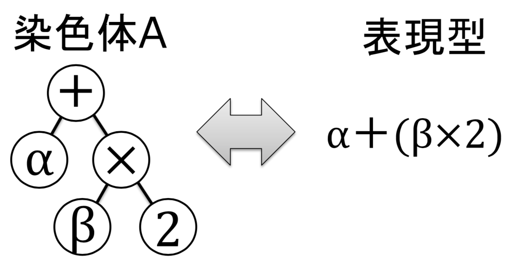
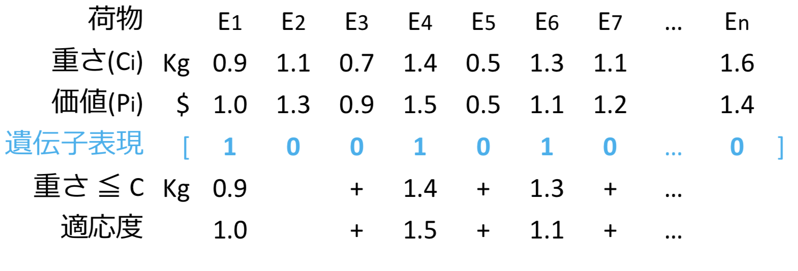
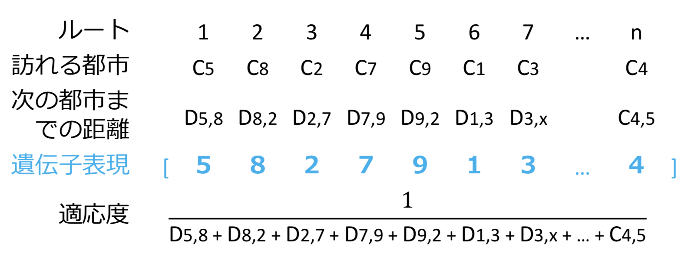
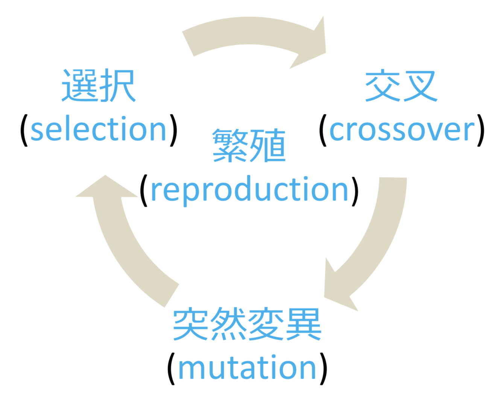
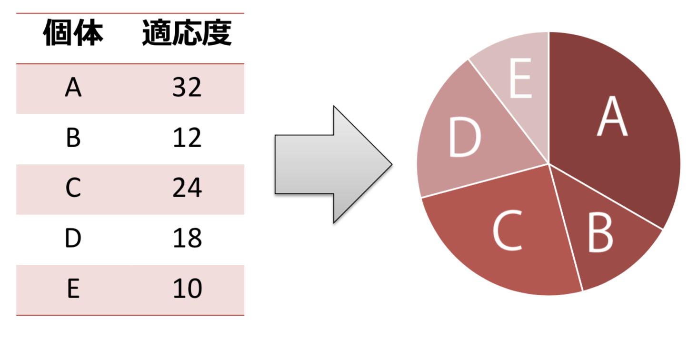
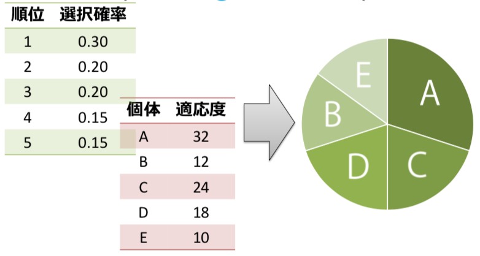
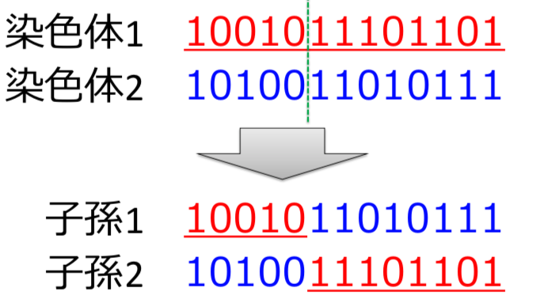

# GA(遺伝的アルゴリズム)

- ある命題に対する解の候補を遺伝子(gene)とその集合体である染色体()chromosomeで表現した個体(individual)を複数用意し，適応度(fitness)の高い個体を優先して交叉(crossover)，突然変異(mutation)などの操作を繰り返しながら最適解の探索を行う

- gene(遺伝子):個体の形質を表すための基本となる構成要素
- chromosome(染色体):複数の遺伝子の集まり
- individual(個体):1つまたは複数の染色体によって表現される自律的な個．命題に対する解の候補
- population(集団):様々な個体の集まり
- locus(遺伝子座):染色体上における各遺伝子の位置
- allele(対立遺伝子):ある遺伝子座において遺伝子が取りうる別の値
- genotype(遺伝子型/因子型):遺伝子を用いた内部表現
- phenotype(表現型):遺伝子によって発現する形質の外部表現
- encoding(符号化):表現型から遺伝子型への変換
- decoding(復号化):遺伝子型から表現型への変換

## アルゴリズム
1. 解を表現する符号化方法を決定する
2. N個のランダムな個体を含む集団を作成する．これを現世代と呼ぶ
3. N個の個体を格納可能な集団を用意する．これを次世代と呼ぶ
4. 評価関数を用いて，現世代の各個体の適応度をそれぞれ計算する
5. ある確率で次の3つの操作を行い，その結果を次世代に保存する．
  1. 現世代から2つの個体を選択する
  2. 選択された個体を用いた交叉を行い，子孫(offspring)を生成する
  3. 交叉によって生成された子孫に対して，突然変異を適用する
6. 次世代の個体数がN個になるまで5の操作を繰り返す
7. 次世代を現世代に移行し，命題が収束するまで3~6の手順を繰り返す．この結果を最終世代と呼ぶ．命題の収束を判定する方法として…
  1. 集団中の最大適応度が，ある閾値より大きくなった場合
  2. 集団全体の平均適応度が，ある閾値より大きくなった場合
  3. 集団の適応度増加率が，ある閾値以下の世代が一定期間続いた場合
  4. 世代交代の回数が規定の最大世代数に達した場合
8. 最終世代の中で最も適応度の高い個体を解として出力する

## Chromosome Encodings
- 解の特徴を遺伝子として表現する
1. binary encoding(バイナリエンコーディング)
  - 各遺伝子を0,1のビットとして表現する符号化方法
  ```
  染色体A 1001011101101
  染色体B 1010011010111
  ```
2. permutation encoding(順列エンコーディング)
- 各遺伝子を順序を示す数字として表現する符号化方法
```
染色体A 2 7 6 4 1 8 3 5 9
染色体B 4 6 1 9 5 7 3 8 2
```
- 巡回セールスマン問題や仕事の順序などの並べ替え問題の表現に用いられる
3. real encoding(実数値エンコーディング)
- 各遺伝子を数値(または文字)として表現する符号化方法
```
染色体A 0.51 2.83 3.12 1.50
染色体B AGTCATGCAGCATTA
染色体C 前進前進右後退左
```
- 実数値データなど，バイナリエンコーディングでは表現が難しい場合に用いる
4. tree encoding(木構造エンコーディング)
- 染色体を1本の紐(配列)ではなく，木構造データとして表現する符号化方法

- 遺伝的プログラミング(Genetic Programming;GP)や進化的プログラミング(Evolutionary Programming;EP)などの表現に用いられる

## Encoding Examples
- Knapsack Problem(ナップザック問題)
  - 容量Cのナップザックが1つと，各々の価値が$P_i$，容積が$C_i$であるところのnこの品物$E_i$が与えられた時，Cを超えない範囲でいくつかの品物をナップザックに詰め，入れた品物の価値の和を最大化するにはどの品物を選べば良いか?
  - ナップザック問題をバイナリエンコーディングで表現してみる
    - n個の荷物 -> 遺伝子長(L) = n
    - i番目の荷物 -> 遺伝子座(p) = i
    - 荷物$E_i$を入れる -> 遺伝子[i] = 1
    - 荷物$E_i$を入れない -> 遺伝子[i] = 0
    - 適応度 -> 持っている荷物の総価値
  
- Travelling Salesman Problem(循環セールスマン問題)
  - n個の都市$C_i$と，それぞれの都市間の距離$D_i,j$が与えられている時，最初の都市を出発し，全ての都市を経由して，同じ年に戻ってくるルートのうち，最短のルートを求めよ
  - 循環セールスマン問題を順列エンコーディングで表現してみる
    - n個の都市 -> 遺伝子長(L) = n
    - i番目に訪れる -> 遺伝子座(p) = i
    - 都市$C_x$ -> 遺伝子[i] = x
    - 適応度 -> 循環ルートの総距離
  

## Genetic Operations

### selection(選択)
- 適応度に基づいて，個体を増やしたり減らしたりするための対象を選び出す操作．生物の自然淘汰をモデル化したもの
1. roulette wheel selection(ルーレット方式):集団をルーレット版に見立て，ランダムな選択を行う方式．各個体の適応度が，ルーレット版の面積と比例しており，適応度が高い染色体ほど選ばれる確率が高くなる

$$ p_i = \frac{f(i)}{\sum^N_{n=1}f(n)} $$
- $p_i$ := ある個体が選択される確率
- $f(i)$ := 個体の適応度
- $N$ := 集団サイズ
- 適性度が正であることが前提．個体間の適応度の差が大きい場合，適応度の高い個体の選ばれる確率が高くなりすぎ，局所的な最適解への初期収束の原因となる
2. ranking selection(ランキング方式)
- ルーレット方式の変形．適応度によって各個体のランク付けを行い，1位なら確率$p_1$，2位なら確率$p_2$，…と事前に決められた確率を適用する方式

- 個体間の適応度の差が選択確率に影響されないが，適応度に差がない個体であっても選択確率に大きな差が生じる可能性がある．ランク付けを行うためには世代ごとにソートを行うことが必要．
3. tournament selection(トーナメント方式)
- あらかじめ決めた個体数(トーナメントサイズ)をランダムに抽出し，その中で最も適応度の高い個体を選択する方式．
- トーナメントサイズを変更することで，選択圧をコントロールすることが可能．トーナメントサイズを大きくすることで選択圧を高めることができるが，初期収束の原因となる．
4. elitism(エリート主義)
- あらかじめ決めた個数の，最も適応度の高い個体をそのまま次世代にコピーする．
- 世代間で適応度の最大値が下がらないことが保証される．エリートの遺伝子が集団の中で広まりすぎて，解の多様性が失われる

### crossover(交叉)
- 選ばれた2つの個体の遺伝子の一部を入れ替える操作．生物の後輩をモデル化したもの
- 交叉確率($P_c$):各々の染色体において，交叉が発生する確率．通常，80~95%として設定する
#### 基本的な交叉方式
1. single point crossover(一点交叉)
  - 遺伝子が交差する場所(交叉点;crossover point)をランダムに決定し，その場所より後ろの遺伝子を入れ替える
  
  - 効率が低いため，現在はあまり用いられていない
2. two-point crossover(二点交叉)
3. multi-point crossover(多点交叉)
4. uniform crossover(一様交叉)

### mutation(突然変異)
