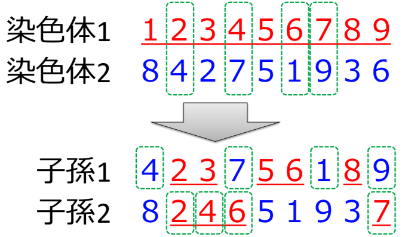
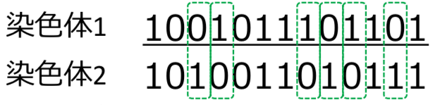

# GA(遺伝的アルゴリズム)

- ある命題に対する解の候補を遺伝子(gene)とその集合体である染色体()chromosomeで表現した個体(individual)を複数用意し，適応度(fitness)の高い個体を優先して交叉(crossover)，突然変異(mutation)などの操作を繰り返しながら最適解の探索を行う

- gene(遺伝子):個体の形質を表すための基本となる構成要素
- chromosome(染色体):複数の遺伝子の集まり
- individual(個体):1つまたは複数の染色体によって表現される自律的な個．命題に対する解の候補
- population(集団):様々な個体の集まり
- locus(遺伝子座):染色体上における各遺伝子の位置
- allele(対立遺伝子):ある遺伝子座において遺伝子が取りうる別の値
- genotype(遺伝子型/因子型):遺伝子を用いた内部表現
- phenotype(表現型):遺伝子によって発現する形質の外部表現
- encoding(符号化):表現型から遺伝子型への変換
- decoding(復号化):遺伝子型から表現型への変換

## アルゴリズム
1. 解を表現する符号化方法を決定する
2. N個のランダムな個体を含む集団を作成する．これを現世代と呼ぶ
3. N個の個体を格納可能な集団を用意する．これを次世代と呼ぶ
4. 評価関数を用いて，現世代の各個体の適応度をそれぞれ計算する
5. ある確率で次の3つの操作を行い，その結果を次世代に保存する．
  1. 現世代から2つの個体を選択する
  2. 選択された個体を用いた交叉を行い，子孫(offspring)を生成する
  3. 交叉によって生成された子孫に対して，突然変異を適用する
6. 次世代の個体数がN個になるまで5の操作を繰り返す
7. 次世代を現世代に移行し，命題が収束するまで3~6の手順を繰り返す．この結果を最終世代と呼ぶ．命題の収束を判定する方法として…
  1. 集団中の最大適応度が，ある閾値より大きくなった場合
  2. 集団全体の平均適応度が，ある閾値より大きくなった場合
  3. 集団の適応度増加率が，ある閾値以下の世代が一定期間続いた場合
  4. 世代交代の回数が規定の最大世代数に達した場合
8. 最終世代の中で最も適応度の高い個体を解として出力する

## Chromosome Encodings
- 解の特徴を遺伝子として表現する
1. binary encoding(バイナリエンコーディング)
  - 各遺伝子を0,1のビットとして表現する符号化方法
  ```
  染色体A 1001011101101
  染色体B 1010011010111
  ```
2. permutation encoding(順列エンコーディング)
- 各遺伝子を順序を示す数字として表現する符号化方法
```
染色体A 2 7 6 4 1 8 3 5 9
染色体B 4 6 1 9 5 7 3 8 2
```
- 巡回セールスマン問題や仕事の順序などの並べ替え問題の表現に用いられる
3. real encoding(実数値エンコーディング)
- 各遺伝子を数値(または文字)として表現する符号化方法
```
染色体A 0.51 2.83 3.12 1.50
染色体B AGTCATGCAGCATTA
染色体C 前進前進右後退左
```
- 実数値データなど，バイナリエンコーディングでは表現が難しい場合に用いる
4. tree encoding(木構造エンコーディング)
- 染色体を1本の紐(配列)ではなく，木構造データとして表現する符号化方法

- 遺伝的プログラミング(Genetic Programming;GP)や進化的プログラミング(Evolutionary Programming;EP)などの表現に用いられる

## Encoding Examples
- Knapsack Problem(ナップザック問題)
  - 容量Cのナップザックが1つと，各々の価値が$P_i$，容積が$C_i$であるところのnこの品物$E_i$が与えられた時，Cを超えない範囲でいくつかの品物をナップザックに詰め，入れた品物の価値の和を最大化するにはどの品物を選べば良いか?
  - ナップザック問題をバイナリエンコーディングで表現してみる
    - n個の荷物 -> 遺伝子長(L) = n
    - i番目の荷物 -> 遺伝子座(p) = i
    - 荷物$E_i$を入れる -> 遺伝子[i] = 1
    - 荷物$E_i$を入れない -> 遺伝子[i] = 0
    - 適応度 -> 持っている荷物の総価値
  
- Travelling Salesman Problem(循環セールスマン問題)
  - n個の都市$C_i$と，それぞれの都市間の距離$D_i,j$が与えられている時，最初の都市を出発し，全ての都市を経由して，同じ年に戻ってくるルートのうち，最短のルートを求めよ
  - 循環セールスマン問題を順列エンコーディングで表現してみる
    - n個の都市 -> 遺伝子長(L) = n
    - i番目に訪れる -> 遺伝子座(p) = i
    - 都市$C_x$ -> 遺伝子[i] = x
    - 適応度 -> 循環ルートの総距離
  

## Genetic Operations

### selection(選択)
- 適応度に基づいて，個体を増やしたり減らしたりするための対象を選び出す操作．生物の自然淘汰をモデル化したもの
1. roulette wheel selection(ルーレット方式):集団をルーレット版に見立て，ランダムな選択を行う方式．各個体の適応度が，ルーレット版の面積と比例しており，適応度が高い染色体ほど選ばれる確率が高くなる

$$ p_i = \frac{f(i)}{\sum^N_{n=1}f(n)} $$
- $p_i$ := ある個体が選択される確率
- $f(i)$ := 個体の適応度
- $N$ := 集団サイズ
- 適性度が正であることが前提．個体間の適応度の差が大きい場合，適応度の高い個体の選ばれる確率が高くなりすぎ，局所的な最適解への初期収束の原因となる
2. ranking selection(ランキング方式)
- ルーレット方式の変形．適応度によって各個体のランク付けを行い，1位なら確率$p_1$，2位なら確率$p_2$，…と事前に決められた確率を適用する方式

- 個体間の適応度の差が選択確率に影響されないが，適応度に差がない個体であっても選択確率に大きな差が生じる可能性がある．ランク付けを行うためには世代ごとにソートを行うことが必要．
3. tournament selection(トーナメント方式)
- あらかじめ決めた個体数(トーナメントサイズ)をランダムに抽出し，その中で最も適応度の高い個体を選択する方式．
- トーナメントサイズを変更することで，選択圧をコントロールすることが可能．トーナメントサイズを大きくすることで選択圧を高めることができるが，初期収束の原因となる．
4. elitism(エリート主義)
- あらかじめ決めた個数の，最も適応度の高い個体をそのまま次世代にコピーする．
- 世代間で適応度の最大値が下がらないことが保証される．エリートの遺伝子が集団の中で広まりすぎて，解の多様性が失われる

### crossover(交叉)
- 選ばれた2つの個体の遺伝子の一部を入れ替える操作．生物の後輩をモデル化したもの
- 交叉確率($P_c$):各々の染色体において，交叉が発生する確率．通常，80~95%として設定する
#### 基本的な交叉方式
1. single point crossover(一点交叉)
  - 遺伝子が交差する場所(交叉点;crossover point)をランダムに決定し，その場所より後ろの遺伝子を入れ替える
  
  - 効率が低いため，現在はあまり用いられていない
2. two-point crossover(二点交叉)
- 2つの交叉点をランダムに決定し，その間の遺伝子を入れ替える

3. multi-point crossover(多点交叉)
- 3つ以上の交叉点をもつ方法．二点交叉や一点交叉より良い値が得られることがほとんどないため，あまり用いられていない．
4. uniform crossover(一様交叉)
- 各遺伝子のそれぞれを所定の確率(通常は1/2)で入れ替える

- 二点交叉が得意とする問題を苦手とし，逆の性質を示す．ヒッチハイキング問題への対策として用いられる

#### 順列エンコーディングに対応した交叉方式
- 同じ遺伝子が重複しないこと
1. cycle crossover;CX(循環交叉)
- 双方の親から重複しない組み合わせを選んで，遺伝子の一部ずつを受け継ぐ

2. order crossover;OX(順序交叉)
- 片方の親からは一部をそのまま受け継ぎ，残りの部分についてはもう片方の親から相対的な順序を受け継ぐ

3. order-based crossover;OX2(一様順序交叉)
- 一様に選んだ遺伝座について，一方の親の遺伝子の出現順序に従って，他方の親の遺伝子を並べ替えたものを受け継ぐ

4. position-based crossover;POX(一様位置交叉)
- 一様に選んだ遺伝子を入れ替え，残しの遺伝子については親と同じ相対順序になるように配置する

5. partially mapped crossover;PMX(部分写像交叉)
- 片親の親$P_1$からは一部をそのまま受け継ぎ，残りの部分についてはもう片方の親$P2$から重複しない遺伝子をそのまま受け継ぐ．重複する遺伝子については，$P_1$上で該当する遺伝子が占める遺伝子座を求め，$P_2$上の同じ遺伝子座に存在する遺伝子を受け継ぐ

6. subtour exchange crossover;SXX(サブツアー交換交叉)
- それぞれの親の間である共通する数字の組み合わせからなる部分順列が存在する場合に，それを交換する．さらに入れ替えた部分順列を逆にしたものを含め，合計4個の子を生成する

7. edge recombination crossover;ERX(変組み換え交叉)
- 順列の繋がり(辺)に注目した交叉方法．双方の親が共通して保有する辺をなるべく多く受け継ぐように子を生成する．

8. edge assembly crossover;EAX(枝組み立て交叉)
- 両親のいずれかが保有する辺のみを用いて複数のサブツアーに分割された不完全解を生成する．サブツアー間を，なるべく短い辺を用いて接続しなおすことで完全解を含む子を生成する

- 経路問題への適用として，計算コストと精度の両面から，現時点において最も優れた方法とされている

#### その他の交叉
1. arithmetic crossover(算術交叉)
2. 平均化交叉
3. BLX-α(ブレンド交叉)
4. UNDX(単峰性正規分布交叉)
5. SPX(シンプレックス交叉)

### mutation(突然変異)
- 個体の遺伝子の一部をランダムに変化させる．生物における突然変異をモデル化したもの．局所解に陥ることを防ぐ効果がある
- 変異確率($P_m$)
  - 各々の染色体において，突然変異が発生する確率．通常，0.1~1%，高くても数%として設定する．確率が低すぎると局所解に陥りやすくなり，高すぎるとランダム探索に近づいて解が収束しにくくなる
1. substitution(置換)
- ランダムに選ばれた遺伝子を対立遺伝子に置き換える

2. perturbation(摂動)
- ランダムに選ばれた遺伝子の値に微量値を加算(または減算)する

3. swap(交換)
- ランダムに選ばれた2つの遺伝子を入れ替える

4. inversion(逆位)
- ランダムに選ばれた2点間の遺伝子を逆順に並べ替える

5. scramble(攪拌)
- ランダムに選ばれた2点間の遺伝子をランダムに並べ替える

6. translocation(転座)
- ランダムに選ばれた2点間の遺伝子を別の遺伝子座に移動する

7. duplication(重複)
- ランダムに選ばれた2点間の遺伝子を別の遺伝子座に複製する

8. insertion(挿入)
- ランダムに選ばれた場所に任意の遺伝子を挿入する

9. deficiency;deletion(欠失)
- ランダムに選ばれた遺伝子を削除する


## New Generation Alternation Model(世代交代モデル)
1. discrete generation model(離散世代モデル)
- 全ての個体が一斉に繁殖を行い，現世代集合全体が次世代集合に置き換えられるモデル．世代間における個体のオーバーラップが存在しない
  1. simple GA(単純GAモデル)
  - ルーレット選択と交叉・突然変異を用いて，親世代と同数の子個体を生成し，子個体のみを次世代として残す．初期収束による局所解の発生や，進化的停滞が起こりやすい
2. continuous generation model(連続世代モデル)
- 現在の世代のうち一定の割合の個体だけを入れ替え，残りはそのまま次世代に残すモデル
  1. generation gap(世代ギャップ)
  - 離散世代モデルにおいて，各世代の個体のうち次世代と入れ替えるものの割合
  2. steady state(定常状態モデル)
  - 1世代につき1組(2個)の親個体から子個体を生成し，現世代のうち最も適応度の低い個体と入れ替える
  3. minimum generation gap;elitist recombination(世代間最小ギャップモデル)
  - ランダムに選択された親個体2個と，そこから作られる子個体2個を1つの家族とする．家族の中でエリート選択とルーレット選択により，2個体を次世代に残す．これを家族の数だけ繰り返す
  - 親子個体の選択を適応度を考慮せずにランダムに行うため，多様性維持に優れており，初期収束が起こりにくい．家族内で選択を行うため，計算負荷が軽く，並列計算への適応もしやすい

## Known Issues
- 初期収束
  - 最初の方の世代で偶然他の個体より適応度が圧倒的に高い個体が生じた場合，その個体の遺伝子が集団中に爆発的に増えて，探索がかなり早い段階で収束してしまう現象
  - 対策
    - 各パラメータを繰り返し設定しなおしてトライするしかない
    - 集団数を増やす
    - ランキングの選択確率を変更する
    - トーナメントサイズを縮小する
    - 突然変異率を増やす
    - 適用する問題に対して効果的となるよう，突然変異操作を変更する
    - 大変異
      - あらかじめ定めた条件に応じて，特定の世代においてのみ突然変異率を急激に高める方法．自然界における環境の激変(隕石の激突など)に相当する
      - 例えば…通常1%に設定した突然変異率を，100で割り切れる世代のみ50%とする
      
    - 適応変異
      - 親個体間の不一致度合い(ハミング距離)に応じて，生成された子個体の突然変異率を変化させる
      - 例えば
      
      - ハミング距離=6 -> 突然変異率=1%
      
      - ハミング距離=2 -> 突然変異率=8%
- ヒッチハイキング
